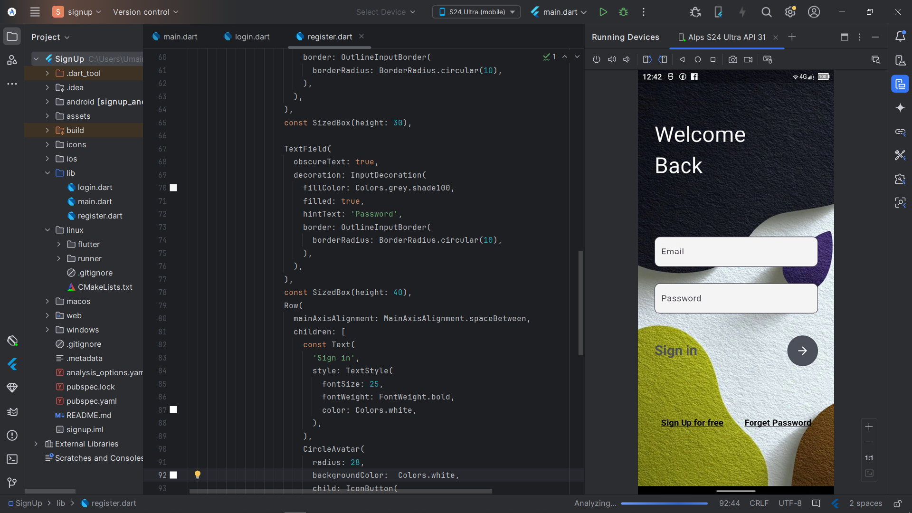

# Flutter Authentication UI — Signup & Login Screens

A clean, modern, and fully responsive Flutter frontend showcasing **Signup** and **Login** screens with elegant UI design. This project serves as a standalone authentication interface ready to be integrated into any Flutter application.

---

## Overview

This repository contains Flutter widgets implementing user-friendly and visually appealing signup and login pages. The UI leverages Flutter's powerful widget system and customization capabilities to deliver a smooth user experience across various device sizes.

---

## Features

- ✨ **Intuitive and polished UI** for user authentication  
- 📐 **Responsive design** supporting different screen dimensions  
- 🎨 Background images with adaptive `BoxFit.cover` and transparent overlays  
- 🔐 Secure password input with obscured text fields  
- 🖱️ Interactive buttons and icons following Material Design principles  
- ⚙️ Easily customizable to fit specific project needs  

---

## Screenshots

| Login Screen                             | Signup Screen                            |
|----------------------------------------|----------------------------------------|
|  |  |

---

## Getting Started

Follow the instructions below to run the project locally:

### Prerequisites

- Flutter SDK (version 3.6.0 or higher) installed on your machine  
- A compatible IDE (e.g., VS Code, Android Studio) or terminal with Flutter configured  

### Installation

1. Clone the repository:
   ```bash
   git clone https://github.com/UM4iR-H3x/login-and-signup-with-flutter.git
